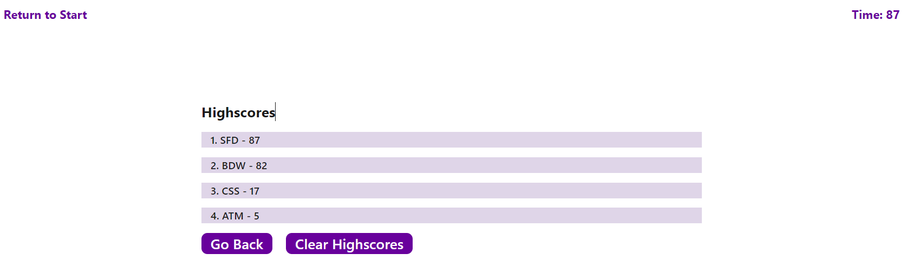

# Coding Assessment

## The goal of this project was to create a coding assessment covering the fundamentals of JavaScript.  This application would mimic an assessment that a employer might user to filter out potential candidates.  

I learned the following:
- How to use jQuery for traversing the DOM.
- Writing more sophisticated "for-loops" and functions for manupilating array and object data.
- Be more succinct and intentional with my coding.
- How to use Stack Overflow to find a unique solution to a problem. 
- How to to interact with local storage: both pulling data and saving newly manipulated data
- Event listeners and timer intervals.

Takeaways:
- This assignment really tested my debugging skills and ability to find tricky solutions to my errors online.    
- I am proud of figuring out how to render the 10 questions in a random order without any repeats each time the quiz is taken.  This also occurs with the available answers, they are not rendered in the same fashion each time.  
- I am happy to have used an array and object to define the questions and answers.  
- It was difficult to store the highscores as a string and add new scores to just one key value in local storage.  It was also a challenge to pair up the intitials with the score and sort them so the highest score is always at the top.
- I would have liked my CSS stylings to have come more naturally and I struggled with a responsive design that looks natural (elements looking the right size).  

## Usage

The final website can be viewed here:
https://briandwach.github.io/codingassessment/

- To start the application, click the Start Quiz button.  
- You will have 100 seconds to answer 10 questions as fast as you can. 
- If you answer a question wrong, the next question will display and you will lose 10 seconds. 
- The quiz ends if you answer all 10 questions or you run out of time. 
- Your score amounts to how much time you have remaining at the end. 
- You can chose to save your score by entering your initials.  
- Feel free to try the quiz multiple times and see how high of a score you can get.  Don't count on the questions and answer options to be presented to you in the same order!

The code repository can be accessed here:
https://github.com/briandwach/codingassessment/

  

## Credits

I used the jass.css reset stylesheet that I was introduced to in my class and can be found in the Northwestern University GitLab repository: NU-VIRT-FSF-PT-12-2023-U-LOLC

at the following private link:
https://git.bootcampcontent.com/Northwestern-University/NU-VIRT-FSF-PT-12-2023-U-LOLC/-/tree/main/03-JavaScript/02-Challenge?ref_type=heads

A relied heavily on the jQuery API library for DOM traversal.
https://code.jquery.com/jquery-3.5.1.min.js

Lastly, this line of code:

scoresToSort.sort((a, b) => b[0] - a[0]); 

is slightly altered from a solution on Stack Overflow by user Vidhya in this thread: (it allowed me to sort an array of arrays by the first key value of each)

https://stackoverflow.com/questions/50415200/sort-an-array-of-arrays-in-javascript